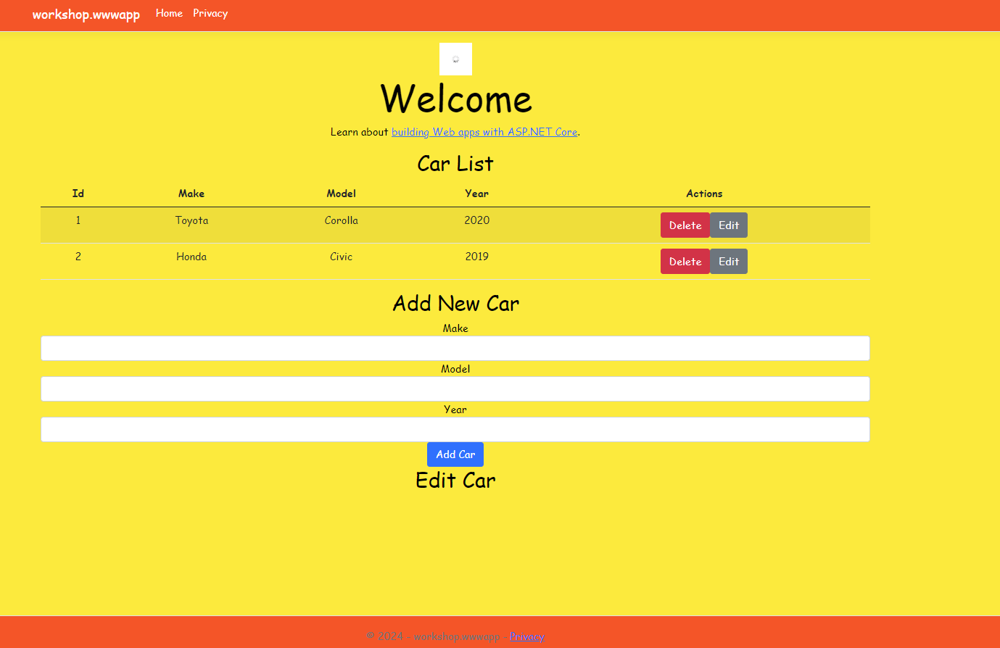

# AI Day 1 Workshop for C#

Generate an entire web application using GitHub Copilot! 

The rules:
- no code was written during this workshop

Thoughts on the experience:
- Do I understand the code?
- Is the code tidy?
- Is the code efficient?
- Is the code production worthy?
- How much time did it save me?
- How easy is this code to maintain?



This repository was setup using:

- ```dotnet new sln --name workshop```
- ```dotnet new webapi --name workshop.wwwapi```
- ```dotnet new webapp --name workshop.webapp```
- ```dotnet sln add **/*.csproj```

# Prompts

The following prompts were given to GitHub Copilot to generate all the code.  The rules were no code written by me!  just asking Copilot to generate it for me and perhaps deleting some code if after the Preview and Apply there were errors.

## 1 - Generating the API

I clicked on the Program.cs in the api and asked:

*Can you provide me with a minimal api with CRUD functionality for a car app?*

```cs

var builder = WebApplication.CreateBuilder(args);

// Add services to the container.
builder.Services.AddEndpointsApiExplorer();
builder.Services.AddSwaggerGen();

var app = builder.Build();

// Configure the HTTP request pipeline.
if (app.Environment.IsDevelopment())
{
    app.UseSwagger();
    app.UseSwaggerUI();
}

app.UseHttpsRedirection();

var cars = new List<Car>
{
    new Car { Id = 1, Make = "Toyota", Model = "Corolla", Year = 2020 },
    new Car { Id = 2, Make = "Honda", Model = "Civic", Year = 2019 }
};

// Get all cars
app.MapGet("/cars", () => cars)
   .WithName("GetAllCars")
   .WithOpenApi();

// Get car by ID
app.MapGet("/cars/{id}", (int id) =>
{
    var car = cars.FirstOrDefault(c => c.Id == id);
    return car is not null ? Results.Ok(car) : Results.NotFound();
})
.WithName("GetCarById")
.WithOpenApi();

// Create a new car
app.MapPost("/cars", (Car car) =>
{
    car.Id = cars.Max(c => c.Id) + 1;
    cars.Add(car);
    return Results.Created($"/cars/{car.Id}", car);
})
.WithName("CreateCar")
.WithOpenApi();

// Update an existing car
app.MapPut("/cars/{id}", (int id, Car updatedCar) =>
{
    var car = cars.FirstOrDefault(c => c.Id == id);
    if (car is null) return Results.NotFound();

    car.Make = updatedCar.Make;
    car.Model = updatedCar.Model;
    car.Year = updatedCar.Year;

    return Results.NoContent();
})
.WithName("UpdateCar")
.WithOpenApi();

// Delete a car
app.MapDelete("/cars/{id}", (int id) =>
{
    var car = cars.FirstOrDefault(c => c.Id == id);
    if (car is null) return Results.NotFound();

    cars.Remove(car);
    return Results.NoContent();
})
.WithName("DeleteCar")
.WithOpenApi();

app.Run();

record Car
{
    public int Id { get; set; }
    public string Make { get; set; }
    public string Model { get; set; }
    public int Year { get; set; }
}
```

## 2 - Generating the web page

I asked:

*can you provide me with a webpage that generates an html table from the car api located here: https://localhost:7183/*

```cs
@page
@model IndexModel
@{
    ViewData["Title"] = "Home page";
}

<div class="text-center">
    <h1 class="display-4">Welcome</h1>
    <p>Learn about <a href="https://learn.microsoft.com/aspnet/core">building Web apps with ASP.NET Core</a>.</p>
</div>

<div class="container">
    <h2>Car List</h2>
    <table class="table table-striped" id="carTable">
        <thead>
            <tr>
                <th>Id</th>
                <th>Make</th>
                <th>Model</th>
                <th>Year</th>
            </tr>
        </thead>
        <tbody>
            <!-- Car rows will be inserted here by JavaScript -->
        </tbody>
    </table>
</div>

@section Scripts {
    <script>
        document.addEventListener("DOMContentLoaded", function() {
            fetch('https://localhost:7183/cars')
                .then(response => response.json())
                .then(data => {
                    const tableBody = document.getElementById('carTable').getElementsByTagName('tbody')[0];
                    data.forEach(car => {
                        const row = tableBody.insertRow();
                        row.insertCell(0).textContent = car.id;
                        row.insertCell(1).textContent = car.make;
                        row.insertCell(2).textContent = car.model;
                        row.insertCell(3).textContent = car.year;
                    });
                })
                .catch(error => console.error('Error fetching car data:', error));
        });
    </script>
}
```

## 3 - Fixing an error

I asked:

*that didn't work.  the result table is empty when there should be 2 cars*

```
1.	Check the API URL: Ensure that the API URL https://localhost:7183/cars is correct and accessible.
2.	Inspect the Network Request: Use the browser's developer tools to inspect the network request and response.
3.	Log the Data: Add some logging to see if the data is being fetched correctly.
```

After some debugging, it was clear that there was a CORS error!

Some code was generated which provided with some error logging!  didn't need to add this though.
## - 4 Fixing the CORS error

*can you update the api code in Program.cs to disable any CORS and allow requests from any origin?*

```cs
var builder = WebApplication.CreateBuilder(args);

// Add services to the container.
builder.Services.AddEndpointsApiExplorer();
builder.Services.AddSwaggerGen();

// Add CORS services
builder.Services.AddCors(options =>
{
    options.AddPolicy("AllowAll", builder =>
    {
        builder.AllowAnyOrigin()
               .AllowAnyMethod()
               .AllowAnyHeader();
    });
});

var app = builder.Build();

// Configure the HTTP request pipeline.
if (app.Environment.IsDevelopment())
{
    app.UseSwagger();
    app.UseSwaggerUI();
}

app.UseHttpsRedirection();

// Use the CORS policy
app.UseCors("AllowAll");

var cars = new List<Car>
{
    new Car { Id = 1, Make = "Toyota", Model = "Corolla", Year = 2020 },
    new Car { Id = 2, Make = "Honda", Model = "Civic", Year = 2019 }
};

// Get all cars
app.MapGet("/cars", () => cars)
   .WithName("GetAllCars")
   .WithOpenApi();

// Get car by ID
app.MapGet("/cars/{id}", (int id) =>
{
    var car = cars.FirstOrDefault(c => c.Id == id);
    return car is not null ? Results.Ok(car) : Results.NotFound();
})
.WithName("GetCarById")
.WithOpenApi();

// Create a new car
app.MapPost("/cars", (Car car) =>
{
    car.Id = cars.Max(c => c.Id) + 1;
    cars.Add(car);
    return Results.Created($"/cars/{car.Id}", car);
})
.WithName("CreateCar")
.WithOpenApi();

// Update an existing car
app.MapPut("/cars/{id}", (int id, Car updatedCar) =>
{
    var car = cars.FirstOrDefault(c => c.Id == id);
    if (car is null) return Results.NotFound();

    car.Make = updatedCar.Make;
    car.Model = updatedCar.Model;
    car.Year = updatedCar.Year;

    return Results.NoContent();
})
.WithName("UpdateCar")
.WithOpenApi();

// Delete a car
app.MapDelete("/cars/{id}", (int id) =>
{
    var car = cars.FirstOrDefault(c => c.Id == id);
    if (car is null) return Results.NotFound();

    cars.Remove(car);
    return Results.NoContent();
})
.WithName("DeleteCar")
.WithOpenApi();

app.Run();

record Car
{
    public int Id { get; set; }
    public string Make { get; set; }
    public string Model { get; set; }
    public int Year { get; set; }
}
```

## 5 - Adding the other features

- *can you update my code to include a delete button on the html table that calls the delete endpoint in the api?*
- *can you update my webpage to include a form to add a new car?*
- *can you provide a way for me to edit cars that does a PUT to the relevant endpoint?*

## 6 - Adding some styling

*can you  style my _Layout.cshtml to look a little more like https://www.lingscars.com/ ? including some animated gifs and a bright background?*